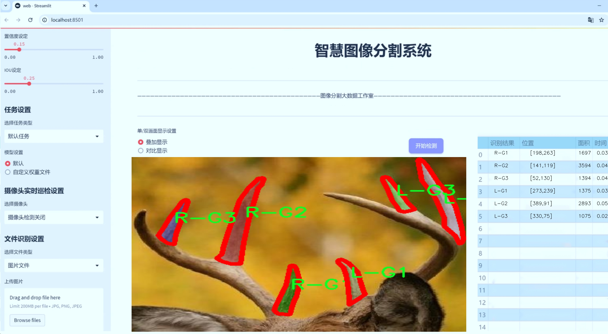
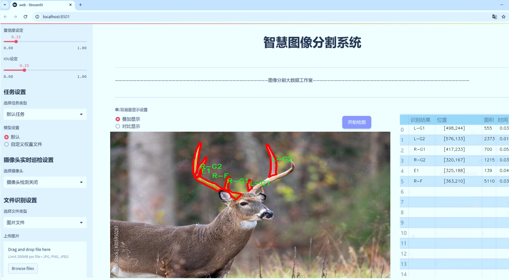
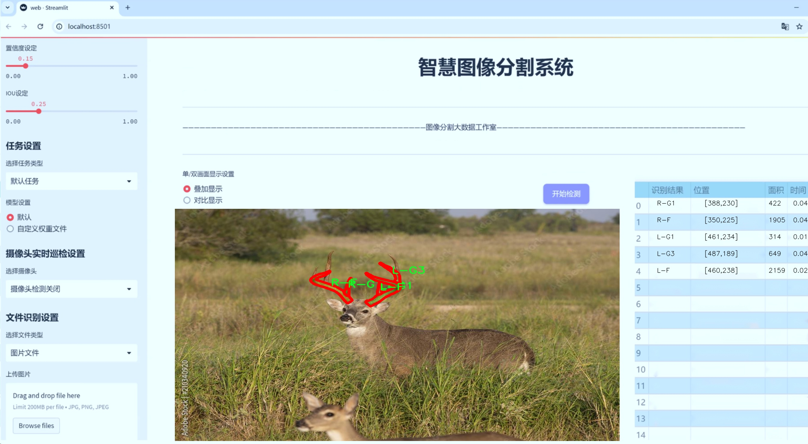
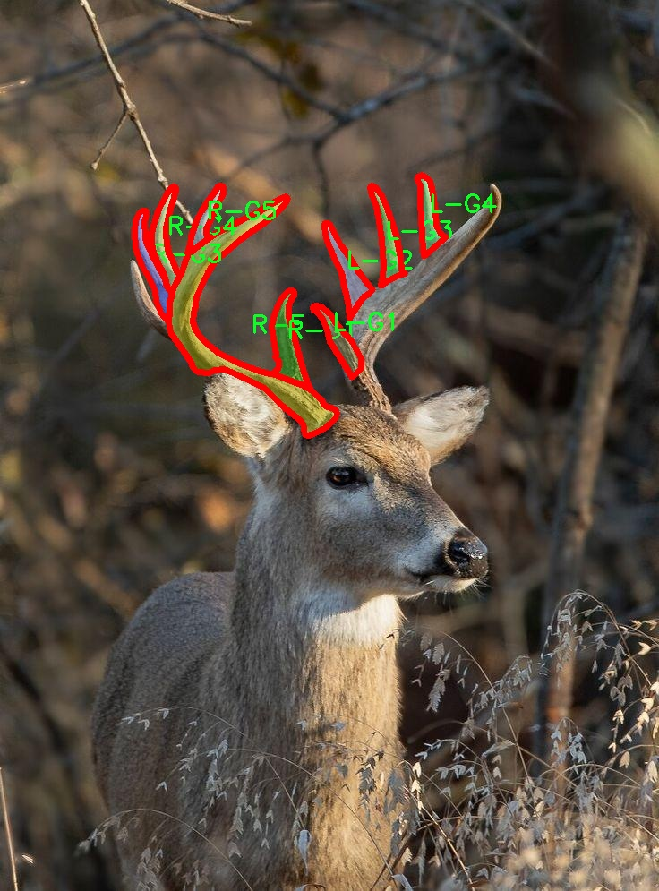
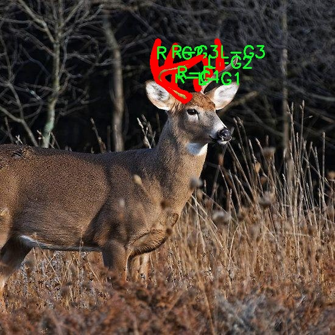
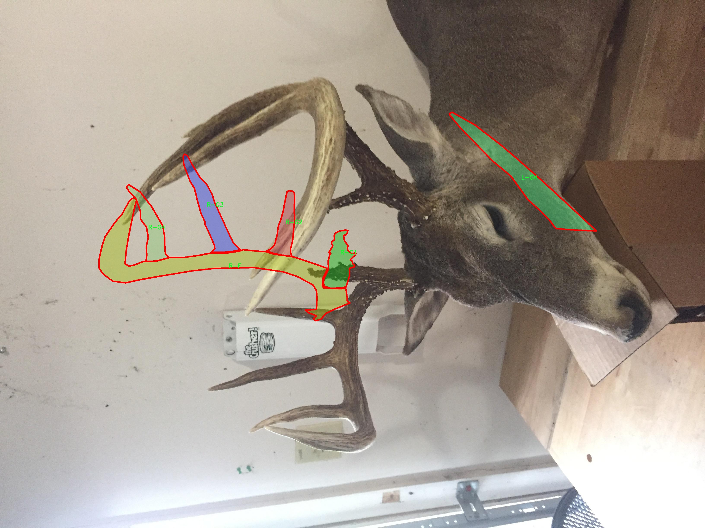
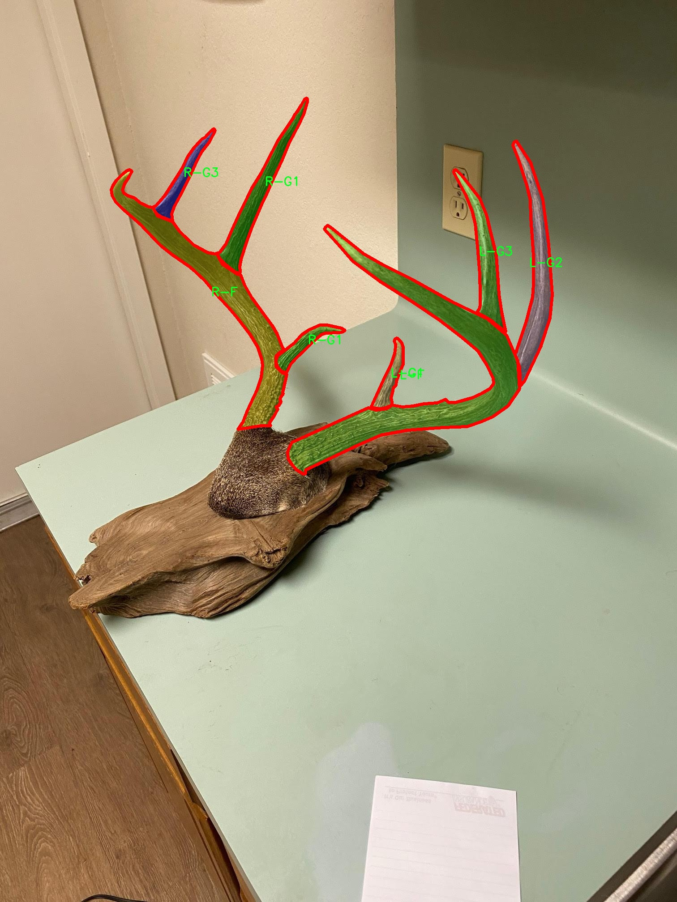
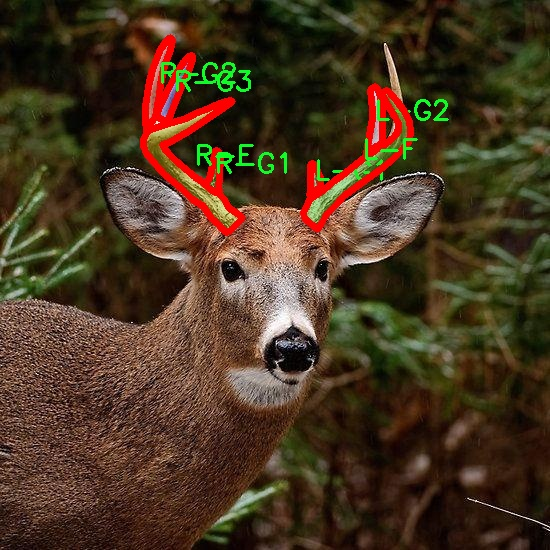

# 鹿角图像分割系统： yolov8-seg-C2f-DCNV2-Dynamic

### 1.研究背景与意义

[参考博客](https://gitee.com/YOLOv8_YOLOv11_Segmentation_Studio/projects)

[博客来源](https://kdocs.cn/l/cszuIiCKVNis)

研究背景与意义

随着计算机视觉技术的快速发展，图像分割在各个领域中的应用日益广泛，尤其是在生物学和生态学研究中，图像分割技术为物种识别、行为分析和环境监测提供了重要的支持。鹿角作为鹿类动物的重要特征，不仅在生态学研究中具有重要的生物学意义，同时也是动物行为学、遗传学及保护生物学等领域研究的关键对象。准确地识别和分割鹿角图像，对于研究鹿类的生长发育、种群动态以及生态环境变化等方面具有重要的现实意义。

本研究旨在基于改进的YOLOv8模型，构建一个高效的鹿角图像分割系统。YOLO（You Only Look Once）系列模型因其高效的实时目标检测能力而受到广泛关注，尤其是YOLOv8在处理复杂场景和小目标检测方面表现出色。然而，传统的YOLO模型在实例分割任务中仍存在一定的局限性，尤其是在细粒度特征提取和边界精确度方面。因此，针对鹿角图像的特性，对YOLOv8进行改进，以提高其在实例分割任务中的表现，具有重要的理论和实践价值。

本研究所使用的数据集包含1400张图像，涵盖24个类别，涉及不同类型的鹿角。这一数据集的丰富性为模型的训练和验证提供了坚实的基础。通过对这些图像进行实例分割，可以有效地提取出鹿角的形状、大小及其与背景的关系，为后续的分析提供数据支持。此外，数据集中包含的多样化类别使得模型能够学习到不同鹿角的特征，从而提高其在实际应用中的泛化能力。

在生态保护和生物多样性维护的背景下，鹿类作为重要的生态指示物种，其生存状态直接反映了生态系统的健康状况。通过精确的鹿角图像分割，可以为生态学家提供更为详实的数据支持，帮助他们更好地理解鹿类的生长规律、繁殖行为及其与环境的相互作用。这不仅有助于科学研究的深入开展，也为制定有效的保护措施提供了重要依据。

综上所述，基于改进YOLOv8的鹿角图像分割系统的研究，不仅具有重要的学术价值，也为生态保护和生物多样性研究提供了新的技术手段。通过提高鹿角图像分割的准确性和效率，本研究将为相关领域的研究者提供更加可靠的数据支持，推动鹿类生态学及相关研究的进一步发展。

### 2.图片演示







注意：本项目提供完整的训练源码数据集和训练教程,由于此博客编辑较早,暂不提供权重文件（best.pt）,需要按照6.训练教程进行训练后实现上图效果。

### 3.视频演示

[3.1 视频演示](https://www.bilibili.com/video/BV1fwUmYoEnr/)

### 4.数据集信息

##### 4.1 数据集类别数＆类别名

nc: 24
names: ['E-1', 'E1', 'E2', 'E3', 'E4', 'L-E1', 'L-F', 'L-G1', 'L-G2', 'L-G3', 'L-G4', 'L-G5', 'L-G6', 'L-R', 'R-E1', 'R-F', 'R-G1', 'R-G2', 'R-G3', 'R-G4', 'R-G5', 'R-G6', 'R-G7', 'R-R']


##### 4.2 数据集信息简介

数据集信息展示

在本研究中，我们使用了名为“Antler_detection”的数据集，以训练和改进YOLOv8-seg模型在鹿角图像分割任务中的表现。该数据集专门设计用于处理鹿角的多样性，涵盖了24个不同的类别，旨在为模型提供丰富的训练样本，以提高其在实际应用中的准确性和鲁棒性。

“Antler_detection”数据集的类别数量为24，具体类别包括：E-1、E1、E2、E3、E4、L-E1、L-F、L-G1、L-G2、L-G3、L-G4、L-G5、L-G6、L-R、R-E1、R-F、R-G1、R-G2、R-G3、R-G4、R-G5、R-G6、R-G7和R-R。这些类别不仅反映了鹿角的不同形态和结构特征，还考虑了鹿角在不同生长阶段和不同种类中的变化。这种多样性使得数据集在训练过程中能够涵盖广泛的场景和条件，从而增强模型的泛化能力。

数据集中的每个类别都代表了特定的鹿角特征，例如，E类可能代表了某种特定的鹿种或生长阶段的鹿角，而L类和R类则可能对应于左侧和右侧的鹿角，进一步细分为不同的形态和特征。这种细致的分类方式不仅为模型提供了丰富的标注信息，也为后续的图像分割任务奠定了坚实的基础。

在数据集的构建过程中，研究团队对每个类别的样本进行了精心挑选和标注，确保每个类别的样本在数量和质量上都能满足训练需求。数据集中的图像来源于多个不同的环境和条件，涵盖了自然栖息地、人工饲养场所等多种场景，确保了数据的多样性和代表性。这种多样化的图像来源使得模型在面对不同背景和光照条件时，能够保持较高的分割精度。

为了进一步提升YOLOv8-seg模型的性能，数据集还包含了丰富的图像标注信息，包括每个类别的边界框和分割掩码。这些标注信息为模型的训练提供了必要的监督信号，使其能够在训练过程中学习到不同类别的特征和分布，从而在实际应用中实现高效的图像分割。

总之，“Antler_detection”数据集为改进YOLOv8-seg的鹿角图像分割系统提供了一个强大的基础。通过对24个类别的细致划分和丰富的样本选择，该数据集不仅增强了模型的训练效果，也为未来的研究和应用提供了宝贵的数据支持。随着模型的不断优化和数据集的进一步扩展，我们期待在鹿角图像分割领域取得更为显著的进展。











### 5.项目依赖环境部署教程（零基础手把手教学）

[5.1 环境部署教程链接（零基础手把手教学）](https://www.bilibili.com/video/BV1jG4Ve4E9t/?vd_source=bc9aec86d164b67a7004b996143742dc)


[5.2 安装Python虚拟环境创建和依赖库安装视频教程链接（零基础手把手教学）](https://www.bilibili.com/video/BV1nA4VeYEze/?vd_source=bc9aec86d164b67a7004b996143742dc)

### 6.手把手YOLOV8-seg训练视频教程（零基础手把手教学）

[6.1 手把手YOLOV8-seg训练视频教程（零基础小白有手就能学会）](https://www.bilibili.com/video/BV1cA4VeYETe/?vd_source=bc9aec86d164b67a7004b996143742dc)


按照上面的训练视频教程链接加载项目提供的数据集，运行train.py即可开始训练



     Epoch   gpu_mem       box       obj       cls    labels  img_size
     1/200     0G   0.01576   0.01955  0.007536        22      1280: 100%|██████████| 849/849 [14:42<00:00,  1.04s/it]
               Class     Images     Labels          P          R     mAP@.5 mAP@.5:.95: 100%|██████████| 213/213 [01:14<00:00,  2.87it/s]
                 all       3395      17314      0.994      0.957      0.0957      0.0843

     Epoch   gpu_mem       box       obj       cls    labels  img_size
     2/200     0G   0.01578   0.01923  0.007006        22      1280: 100%|██████████| 849/849 [14:44<00:00,  1.04s/it]
               Class     Images     Labels          P          R     mAP@.5 mAP@.5:.95: 100%|██████████| 213/213 [01:12<00:00,  2.95it/s]
                 all       3395      17314      0.996      0.956      0.0957      0.0845

     Epoch   gpu_mem       box       obj       cls    labels  img_size
     3/200     0G   0.01561    0.0191  0.006895        27      1280: 100%|██████████| 849/849 [10:56<00:00,  1.29it/s]
               Class     Images     Labels          P          R     mAP@.5 mAP@.5:.95: 100%|███████   | 187/213 [00:52<00:00,  4.04it/s]
                 all       3395      17314      0.996      0.957      0.0957      0.0845


### 7.50+种全套YOLOV8-seg创新点加载调参实验视频教程（一键加载写好的改进模型的配置文件）

[7.1 50+种全套YOLOV8-seg创新点加载调参实验视频教程（一键加载写好的改进模型的配置文件）](https://www.bilibili.com/video/BV1Hw4VePEXv/?vd_source=bc9aec86d164b67a7004b996143742dc)

### YOLOV8-seg算法简介

原始YOLOV8-seg算法原理

YOLO（You Only Look Once）系列算法自其首次提出以来，便以其高效的目标检测能力在计算机视觉领域占据了一席之地。YOLOv8-seg作为该系列的最新成员，继承并发展了前几代算法的优点，特别是在实时性和准确性方面的表现。YOLOv8-seg不仅在目标检测上表现出色，还扩展了其应用范围，加入了分割功能，使其在处理复杂场景时更加灵活和高效。

YOLOv8-seg的网络结构主要由三个部分组成：输入端、主干网络和检测端。输入端负责接收图像数据，并进行必要的预处理，以确保输入数据的质量和一致性。主干网络则是特征提取的核心部分，YOLOv8-seg采用了CSP（Cross Stage Partial）结构，这种结构通过将特征提取过程分为两部分，分别进行卷积和连接，能够有效地减少计算量，同时保持特征信息的完整性。特别地，YOLOv8-seg在主干网络中引入了C2f模块，该模块在C3模块的基础上进行了改进，增加了更多的残差连接，增强了梯度流动，从而提升了模型的学习能力。

在特征融合方面，YOLOv8-seg继续采用PAN-FPN（Path Aggregation Network - Feature Pyramid Network）结构。该结构通过多尺度特征融合，使得模型能够在不同尺度上对目标进行检测和分割，确保了对小目标和大目标的良好检测能力。PAN-FPN的设计使得高层特征与低层特征能够有效结合，从而提升了分割精度和检测性能。

YOLOv8-seg在检测端的设计上也进行了创新，采用了解耦合头结构。这种结构将分类和定位任务分开处理，使得模型在处理这两类任务时能够更加专注于各自的特征提取。具体而言，分类头负责提取图像中物体的类别信息，而定位头则专注于物体边界框的精确定位。这种解耦合的设计理念不仅提高了模型的收敛速度，还提升了预测的准确性。此外，YOLOv8-seg摒弃了传统的Anchor-Based方法，转而采用Anchor-Free的检测方式，这种方式直接预测目标的中心点，简化了模型的复杂性，同时提高了检测的灵活性。

在训练过程中，YOLOv8-seg对数据增强策略进行了优化。研究表明，尽管Mosaic数据增强在提升模型鲁棒性方面有一定效果，但在某些情况下可能会导致模型学习到不良信息。因此，YOLOv8-seg在训练的最后10个epoch中停止使用Mosaic增强，以确保模型能够更好地适应真实数据分布。此外，YOLOv8-seg还引入了动态任务对齐学习（Task-Aligned Learning）策略，通过对正负样本的动态分配，进一步提升了模型的训练效果。

在损失函数的设计上，YOLOv8-seg使用了BCELoss作为分类损失，DFLLoss和CIoULoss作为回归损失。这种组合损失函数的设计使得模型在训练过程中能够更好地平衡分类和定位任务的损失，从而提高整体性能。

YOLOv8-seg在性能上也取得了显著的提升。根据官方在COCO数据集上的测试结果，YOLOv8-seg在同等模型尺寸下，参数量并未显著增加，但在精度和推理速度上均优于前几代YOLO模型。这使得YOLOv8-seg在实际应用中，尤其是在需要实时处理的场景中，展现出更强的竞争力。

综上所述，YOLOv8-seg通过对网络结构的创新、特征提取和融合策略的优化、解耦合头的引入以及损失函数的改进，展现了其在目标检测和分割任务中的优越性能。其设计理念不仅关注模型的准确性，还兼顾了实时性，使得YOLOv8-seg在各种复杂场景下都能表现出色。这些创新和改进为未来的计算机视觉研究提供了新的思路，也为实际应用中的智能监控、自动驾驶等领域奠定了坚实的基础。随着YOLOv8-seg的不断发展和完善，其在更广泛的应用场景中的潜力将不断被挖掘，成为计算机视觉领域的重要工具。


### 9.系统功能展示（检测对象为举例，实际内容以本项目数据集为准）

图9.1.系统支持检测结果表格显示

  图9.2.系统支持置信度和IOU阈值手动调节

  图9.3.系统支持自定义加载权重文件best.pt(需要你通过步骤5中训练获得)

  图9.4.系统支持摄像头实时识别

  图9.5.系统支持图片识别

  图9.6.系统支持视频识别

  图9.7.系统支持识别结果文件自动保存

  图9.8.系统支持Excel导出检测结果数据


### 10.50+种全套YOLOV8-seg创新点原理讲解（非科班也可以轻松写刊发刊，V11版本正在科研待更新）

#### 10.1 由于篇幅限制，每个创新点的具体原理讲解就不一一展开，具体见下列网址中的创新点对应子项目的技术原理博客网址【Blog】：


[10.1 50+种全套YOLOV8-seg创新点原理讲解链接](https://gitee.com/qunmasj/good)

#### 10.2 部分改进模块原理讲解(完整的改进原理见上图和技术博客链接)【如果此小节的图加载失败可以通过CSDN或者Github搜索该博客的标题访问原始博客，原始博客图片显示正常】
### YOLOv8简介

YOLOv8 是 Ultralytics 公司继 YOLOv5 算法之后开发的下一代算法模型，目前支持图像分类、物体检测和实例分割任务。YOLOv8 是一个 SOTA 模型，它建立在之前YOLO 系列模型的成功基础上，并引入了新的功能和改进，以进一步提升性能和灵活性。具体创新包括：一个新的骨干网络、一个新的 Ancher-Free 检测头和一个新的损失函数，可以在从 CPU 到 GPU 的各种硬件平台上运行。注意到ultralytics 并没有直接将开源库命名为 YOLOv8，而是直接使用 Ultralytics这个单词，原因是Ultralytics这个库的定位是算法框架，而非特指某一个特定算法，其希望这个库不仅仅能够用于 YOLO 系列模型，同时也能支持其他的视觉任务如图像分类、实例分割等。下图画图YOLOv8目标检测算法同其他YOLO系列算法（YOLOv5、6、7）的实验对比图，左边是模型参数量对比，右边是速度对比。


下面两个表分别是YOLOv8和YOLOv5（v7.0版本）官方在 COCO Val 2017 数据集上测试结果，从中看出 YOLOv8 相比 YOLOv5 精度提升大，但是 N/S/M 模型相应的参数量、FLOPS等提高了不少。


#### YOLOv8概述
提供了一个全新的SOTA模型，和YOLOv5一样，基于缩放系数也提供了 N/S/M/L/X 尺度的不同大小模型，用于满足不同场景需求，同时支持图像分类、目标检测、实例分割和姿态检测任务
在骨干网络和Neck部分将YOLOv5的C3结构换成了梯度流更丰富的 C2f 结构，并对不同尺度模型调整了不同的通道数，大幅提升了模型性能；需要注意的是C2f 模块中存在Split等操作对特定硬件部署没有之前那么友好


Head部分换成了目前主流的解耦头结构，将分类和检测头分离，同时也从 Anchor-Based换成了Anchor-Free Loss
计算方面采用了 TaskAlignedAssigner 正样本分配策略，并引入了 Distribution Focal Loss
下图画出YOLOv8目标检测算法的整体结构图


#### YOLOv8模型
YOLOv8目标检测算法的模型配置文件如下：


从配置文件可以看出，YOLOv8与YOLOv5模型最明显的差异是使用C2F模块替换了原来的C3模块，两个模块的结构图下图所示。


另外Head 部分变化最大，从原先的耦合头变成了解耦头，并且从 YOLOv5 的 Anchor-Based 变成了 Anchor-Free。其结构对比图如下所示：

### RepViT简介

近年来，与轻量级卷积神经网络(cnn)相比，轻量级视觉变压器(ViTs)在资源受限的移动设备上表现出了更高的性能和更低的延迟。这种改进通常归功于多头自注意模块，它使模型能够学习全局表示。然而，轻量级vit和轻量级cnn之间的架构差异还没有得到充分的研究。在这项研究中，我们重新审视了轻量级cnn的高效设计，并强调了它们在移动设备上的潜力。通过集成轻量级vit的高效架构选择，我们逐步增强了标准轻量级CNN的移动友好性，特别是MobileNetV3。这就产生了一个新的纯轻量级cnn家族，即RepViT。大量的实验表明，RepViT优于现有的轻型vit，并在各种视觉任务中表现出良好的延迟。在ImageNet上，RepViT在iPhone 12上以近1ms的延迟实现了超过80%的top-1精度，据我们所知，这是轻量级模型的第一次。

#### RepViT简介
轻量级模型研究一直是计算机视觉任务中的一个焦点，其目标是在降低计算成本的同时达到优秀的性能。轻量级模型与资源受限的移动设备尤其相关，使得视觉模型的边缘部署成为可能。在过去十年中，研究人员主要关注轻量级卷积神经网络（CNNs）的设计，提出了许多高效的设计原则，包括可分离卷积 、逆瓶颈结构 、通道打乱 和结构重参数化等，产生了 MobileNets ，ShuffleNets和 RepVGG 等代表性模型。

另一方面，视觉 Transformers（ViTs）成为学习视觉表征的另一种高效方案。与 CNNs 相比，ViTs 在各种计算机视觉任务中表现出了更优越的性能。然而，ViT 模型一般尺寸很大，延迟很高，不适合资源受限的移动设备。因此，研究人员开始探索 ViT 的轻量级设计。许多高效的ViTs设计原则被提出，大大提高了移动设备上 ViTs 的计算效率，产生了EfficientFormers ，MobileViTs等代表性模型。这些轻量级 ViTs 在移动设备上展现出了相比 CNNs 的更强的性能和更低的延迟。

轻量级 ViTs 优于轻量级 CNNs 的原因通常归结于多头注意力模块，该模块使模型能够学习全局表征。然而，轻量级 ViTs 和轻量级 CNNs 在块结构、宏观和微观架构设计方面存在值得注意的差异，但这些差异尚未得到充分研究。这自然引出了一个问题：轻量级 ViTs 的架构选择能否提高轻量级 CNN 的性能？在这项工作中，我们结合轻量级 ViTs 的架构选择，重新审视了轻量级 CNNs 的设计。我们的旨在缩小轻量级 CNNs 与轻量级 ViTs 之间的差距，并强调前者与后者相比在移动设备上的应用潜力。


在 ConvNeXt 中，参考该博客提出的基于 ResNet50 架构的基础上通过严谨的理论和实验分析，最终设计出一个非常优异的足以媲美 Swin-Transformer 的纯卷积神经网络架构。同样地，RepViT也是主要通过将轻量级 ViTs 的架构设计逐步整合到标准轻量级 CNN，即MobileNetV3-L，来对其进行针对性地改造（魔改）。在这个过程中，作者们考虑了不同粒度级别的设计元素，并通过一系列步骤达到优化的目标。


详细优化步骤如下：

#### 训练配方的对齐
论文中引入了一种衡量移动设备上延迟的指标，并将训练策略与现有的轻量级 ViTs 对齐。这一步骤主要是为了确保模型训练的一致性，其涉及两个概念，即延迟度量和训练策略的调整。

#### 延迟度量指标
为了更准确地衡量模型在真实移动设备上的性能，作者选择了直接测量模型在设备上的实际延迟，以此作为基准度量。这个度量方法不同于之前的研究，它们主要通过FLOPs或模型大小等指标优化模型的推理速度，这些指标并不总能很好地反映在移动应用中的实际延迟。

#### 训练策略的对齐
这里，将 MobileNetV3-L 的训练策略调整以与其他轻量级 ViTs 模型对齐。这包括使用 AdamW 优化器-ViTs 模型必备的优化器，进行 5 个 epoch 的预热训练，以及使用余弦退火学习率调度进行 300 个 epoch 的训练。尽管这种调整导致了模型准确率的略微下降，但可以保证公平性。

#### 块设计的优化
基于一致的训练设置，作者们探索了最优的块设计。块设计是 CNN 架构中的一个重要组成部分，优化块设计有助于提高网络的性能。

#### 分离 Token 混合器和通道混合器
这块主要是对 MobileNetV3-L 的块结构进行了改进，分离了令牌混合器和通道混合器。原来的 MobileNetV3 块结构包含一个 1x1 扩张卷积，然后是一个深度卷积和一个 1x1 的投影层，然后通过残差连接连接输入和输出。在此基础上，RepViT 将深度卷积提前，使得通道混合器和令牌混合器能够被分开。为了提高性能，还引入了结构重参数化来在训练时为深度滤波器引入多分支拓扑。最终，作者们成功地在 MobileNetV3 块中分离了令牌混合器和通道混合器，并将这种块命名为 RepViT 块。

#### 降低扩张比例并增加宽度
在通道混合器中，原本的扩张比例是 4，这意味着 MLP 块的隐藏维度是输入维度的四倍，消耗了大量的计算资源，对推理时间有很大的影响。为了缓解这个问题，我们可以将扩张比例降低到 2，从而减少了参数冗余和延迟，使得 MobileNetV3-L 的延迟降低到 0.65ms。随后，通过增加网络的宽度，即增加各阶段的通道数量，Top-1 准确率提高到 73.5%，而延迟只增加到 0.89ms！

#### 宏观架构元素的优化
在这一步，本文进一步优化了MobileNetV3-L在移动设备上的性能，主要是从宏观架构元素出发，包括 stem，降采样层，分类器以及整体阶段比例。通过优化这些宏观架构元素，模型的性能可以得到显著提高。

#### 浅层网络使用卷积提取器
ViTs 通常使用一个将输入图像分割成非重叠补丁的 “patchify” 操作作为 stem。然而，这种方法在训练优化性和对训练配方的敏感性上存在问题。因此，作者们采用了早期卷积来代替，这种方法已经被许多轻量级 ViTs 所采纳。对比之下，MobileNetV3-L 使用了一个更复杂的 stem 进行 4x 下采样。这样一来，虽然滤波器的初始数量增加到24，但总的延迟降低到0.86ms，同时 top-1 准确率提高到 73.9%。

#### 更深的下采样层
在 ViTs 中，空间下采样通常通过一个单独的补丁合并层来实现。因此这里我们可以采用一个单独和更深的下采样层，以增加网络深度并减少由于分辨率降低带来的信息损失。具体地，作者们首先使用一个 1x1 卷积来调整通道维度，然后将两个 1x1 卷积的输入和输出通过残差连接，形成一个前馈网络。此外，他们还在前面增加了一个 RepViT 块以进一步加深下采样层，这一步提高了 top-1 准确率到 75.4%，同时延迟为 0.96ms。

#### 更简单的分类器
在轻量级 ViTs 中，分类器通常由一个全局平均池化层后跟一个线性层组成。相比之下，MobileNetV3-L 使用了一个更复杂的分类器。因为现在最后的阶段有更多的通道，所以作者们将它替换为一个简单的分类器，即一个全局平均池化层和一个线性层，这一步将延迟降低到 0.77ms，同时 top-1 准确率为 74.8%。

#### 整体阶段比例
阶段比例代表了不同阶段中块数量的比例，从而表示了计算在各阶段中的分布。论文选择了一个更优的阶段比例 1:1:7:1，然后增加网络深度到 2:2:14:2，从而实现了一个更深的布局。这一步将 top-1 准确率提高到 76.9%，同时延迟为 1.02 ms。

#### 卷积核大小的选择
众所周知，CNNs 的性能和延迟通常受到卷积核大小的影响。例如，为了建模像 MHSA 这样的远距离上下文依赖，ConvNeXt 使用了大卷积核，从而实现了显著的性能提升。然而，大卷积核对于移动设备并不友好，因为它的计算复杂性和内存访问成本。MobileNetV3-L 主要使用 3x3 的卷积，有一部分块中使用 5x5 的卷积。作者们将它们替换为3x3的卷积，这导致延迟降低到 1.00ms，同时保持了76.9%的top-1准确率。

#### SE 层的位置
自注意力模块相对于卷积的一个优点是根据输入调整权重的能力，这被称为数据驱动属性。作为一个通道注意力模块，SE层可以弥补卷积在缺乏数据驱动属性上的限制，从而带来更好的性能。MobileNetV3-L 在某些块中加入了SE层，主要集中在后两个阶段。然而，与分辨率较高的阶段相比，分辨率较低的阶段从SE提供的全局平均池化操作中获得的准确率提升较小。作者们设计了一种策略，在所有阶段以交叉块的方式使用SE层，从而在最小的延迟增量下最大化准确率的提升，这一步将top-1准确率提升到77.4%，同时延迟降低到0.87ms。

注意！【这一点其实百度在很早前就已经做过实验比对得到过这个结论了，SE 层放置在靠近深层的地方效果好】

#### 微观设计的调整
RepViT 通过逐层微观设计来调整轻量级 CNN，这包括选择合适的卷积核大小和优化挤压-激励（Squeeze-and-excitation，简称SE）层的位置。这两种方法都能显著改善模型性能。

#### 网络架构
最终，通过整合上述改进策略，我们便得到了模型RepViT的整体架构，该模型有多个变种，例如RepViT-M1/M2/M3。同样地，不同的变种主要通过每个阶段的通道数和块数来区分。


### 11.项目核心源码讲解（再也不用担心看不懂代码逻辑）

#### 11.1 ultralytics\utils\dist.py

以下是对代码的核心部分进行提炼和详细注释的结果：

```python
# 导入必要的库
import os
import re
import shutil
import socket
import sys
import tempfile
from pathlib import Path

from . import USER_CONFIG_DIR  # 导入用户配置目录
from .torch_utils import TORCH_1_9  # 导入Torch版本信息

def find_free_network_port() -> int:
    """
    查找本地主机上一个空闲的网络端口。

    在单节点训练时，避免连接到真实的主节点，但需要设置
    `MASTER_PORT` 环境变量时非常有用。
    """
    with socket.socket(socket.AF_INET, socket.SOCK_STREAM) as s:
        s.bind(('127.0.0.1', 0))  # 绑定到本地地址和空闲端口
        return s.getsockname()[1]  # 返回分配的端口号

def generate_ddp_file(trainer):
    """生成一个 DDP 文件并返回其文件名。"""
    # 获取训练器的模块和类名
    module, name = f'{trainer.__class__.__module__}.{trainer.__class__.__name__}'.rsplit('.', 1)

    # 创建文件内容，包含训练器的参数和训练逻辑
    content = f'''overrides = {vars(trainer.args)} \nif __name__ == "__main__":
    from {module} import {name}
    from ultralytics.utils import DEFAULT_CFG_DICT

    cfg = DEFAULT_CFG_DICT.copy()
    cfg.update(save_dir='')   # 处理额外的 'save_dir' 键
    trainer = {name}(cfg=cfg, overrides=overrides)
    trainer.train()'''
    
    # 创建存放 DDP 文件的目录
    (USER_CONFIG_DIR / 'DDP').mkdir(exist_ok=True)
    
    # 创建临时文件并写入内容
    with tempfile.NamedTemporaryFile(prefix='_temp_',
                                     suffix=f'{id(trainer)}.py',
                                     mode='w+',
                                     encoding='utf-8',
                                     dir=USER_CONFIG_DIR / 'DDP',
                                     delete=False) as file:
        file.write(content)  # 写入内容到临时文件
    return file.name  # 返回临时文件名

def generate_ddp_command(world_size, trainer):
    """生成并返回用于分布式训练的命令。"""
    import __main__  # 本地导入以避免特定问题
    if not trainer.resume:
        shutil.rmtree(trainer.save_dir)  # 如果不恢复训练，删除保存目录
    
    file = str(Path(sys.argv[0]).resolve())  # 获取当前脚本的绝对路径
    # 定义安全的文件名模式
    safe_pattern = re.compile(r'^[a-zA-Z0-9_. /\\-]{1,128}$')  
    # 检查文件名是否合法且存在，并且以 .py 结尾
    if not (safe_pattern.match(file) and Path(file).exists() and file.endswith('.py')):
        file = generate_ddp_file(trainer)  # 生成 DDP 文件
    
    # 根据 Torch 版本选择分布式命令
    dist_cmd = 'torch.distributed.run' if TORCH_1_9 else 'torch.distributed.launch'
    port = find_free_network_port()  # 查找空闲端口
    # 构建命令列表
    cmd = [sys.executable, '-m', dist_cmd, '--nproc_per_node', f'{world_size}', '--master_port', f'{port}', file]
    return cmd, file  # 返回命令和文件名

def ddp_cleanup(trainer, file):
    """如果创建了临时文件，则删除它。"""
    if f'{id(trainer)}.py' in file:  # 检查文件名是否包含临时文件后缀
        os.remove(file)  # 删除临时文件
```

### 代码分析与注释说明：
1. **查找空闲端口**：`find_free_network_port` 函数用于查找本地可用的网络端口，这在设置分布式训练时非常重要。
2. **生成 DDP 文件**：`generate_ddp_file` 函数创建一个临时 Python 文件，包含训练器的参数和训练逻辑，以便于分布式训练的执行。
3. **生成 DDP 命令**：`generate_ddp_command` 函数构建执行分布式训练的命令，包括处理文件名的合法性检查和选择合适的分布式运行命令。
4. **清理临时文件**：`ddp_cleanup` 函数用于删除在训练过程中生成的临时文件，确保不会留下多余的文件。

以上是对代码的核心部分提炼和详细注释，帮助理解其功能和结构。

这个文件是Ultralytics YOLO项目中的一个模块，主要用于处理分布式训练相关的功能。它包含了一些函数，用于查找可用的网络端口、生成分布式数据并行（DDP）训练所需的文件和命令，以及清理临时文件。

首先，文件导入了一些必要的库，包括操作系统、正则表达式、文件处理、网络通信、系统参数、临时文件和路径处理等。接着，它引入了一个用户配置目录和一个与PyTorch版本相关的常量。

`find_free_network_port`函数用于查找本地主机上可用的网络端口。它创建一个TCP套接字并绑定到本地地址，使用端口0来让操作系统自动选择一个可用的端口。这在单节点训练时非常有用，因为我们不需要连接到真实的主节点，但仍需设置`MASTER_PORT`环境变量。

`generate_ddp_file`函数用于生成一个DDP文件并返回其文件名。它根据传入的训练器对象生成一个Python脚本的内容，该脚本包含了训练器的参数和训练逻辑。生成的文件会被存储在用户配置目录下的`DDP`文件夹中，并且使用临时文件的方式创建，以避免文件名冲突。

`generate_ddp_command`函数用于生成分布式训练的命令。它首先检查训练器是否需要恢复训练，如果不需要，则删除保存目录。接着，它会检查当前执行的文件是否符合安全模式（即文件名只能包含特定字符，并且必须是Python文件）。如果不符合条件，则调用`generate_ddp_file`生成一个临时文件。然后，函数构建分布式训练的命令，使用`torch.distributed.run`或`torch.distributed.launch`来启动训练，并指定每个节点的进程数和主端口。

最后，`ddp_cleanup`函数用于在训练结束后删除临时文件。如果生成的临时文件名与训练器的ID匹配，则会将其删除，以清理不再需要的文件。

总体来说，这个模块的主要目的是为分布式训练提供支持，确保训练过程中的文件管理和网络配置能够顺利进行。

#### 11.2 ultralytics\models\nas\val.py

以下是代码中最核心的部分，并附上详细的中文注释：

```python
import torch
from ultralytics.utils import ops

class NASValidator:
    """
    Ultralytics YOLO NAS 验证器，用于目标检测。

    该类用于后处理由 YOLO NAS 模型生成的原始预测结果。它执行非最大抑制（NMS），以去除重叠和低置信度的框，
    最终生成最终的检测结果。
    """

    def postprocess(self, preds_in):
        """对预测输出应用非最大抑制（NMS）。"""
        # 将预测框从 xyxy 格式转换为 xywh 格式
        boxes = ops.xyxy2xywh(preds_in[0][0])
        
        # 将框和置信度合并，并调整维度顺序
        preds = torch.cat((boxes, preds_in[0][1]), -1).permute(0, 2, 1)
        
        # 应用非最大抑制，去除重叠的框
        return ops.non_max_suppression(preds,
                                       self.args.conf,  # 置信度阈值
                                       self.args.iou,   # IoU 阈值
                                       labels=self.lb,  # 可选的多标签 NMS
                                       multi_label=False,  # 是否使用多标签
                                       agnostic=self.args.single_cls,  # 是否类别无关
                                       max_det=self.args.max_det,  # 最大检测框数量
                                       max_time_img=0.5)  # 每张图像的最大处理时间
```

### 代码注释说明：
1. **导入模块**：导入 `torch` 和 `ultralytics.utils.ops`，后者包含用于处理预测结果的操作。
2. **NASValidator 类**：该类用于处理 YOLO NAS 模型的输出，主要功能是进行后处理以获得最终的检测结果。
3. **postprocess 方法**：该方法是核心功能，负责对模型的预测结果进行非最大抑制（NMS），以去除冗余的检测框。
   - **框格式转换**：将预测框从 `(x1, y1, x2, y2)` 格式转换为 `(x_center, y_center, width, height)` 格式，以便后续处理。
   - **合并框和置信度**：将框和对应的置信度合并为一个张量，并调整维度顺序，以符合 NMS 函数的输入要求。
   - **调用 NMS**：使用 `non_max_suppression` 函数进行非最大抑制，去除重叠的低置信度框，返回最终的检测结果。

这个程序文件是一个用于对象检测的验证器，名为 `NASValidator`，它是基于 Ultralytics YOLO NAS 模型的。该类继承自 `DetectionValidator`，并专门用于处理 YOLO NAS 模型生成的原始预测结果。其主要功能是执行非极大值抑制（NMS），以去除重叠和低置信度的边界框，从而最终生成最终的检测结果。

在这个类中，有几个重要的属性和方法。首先，`args` 是一个命名空间对象，包含了用于后处理的各种配置，比如置信度和 IoU（交并比）阈值。`lb` 是一个可选的张量，用于多标签的非极大值抑制。

`postprocess` 方法是这个类的核心功能之一，它接收原始预测结果 `preds_in` 作为输入。该方法首先将预测框的坐标从 xyxy 格式转换为 xywh 格式，然后将这些框与对应的置信度合并，并进行维度调整。接着，调用 `ops.non_max_suppression` 方法对合并后的预测结果进行非极大值抑制，以去除冗余的边界框，最终返回处理后的结果。

在使用示例中，用户可以通过创建一个 `NAS` 模型实例并获取其验证器，然后调用 `postprocess` 方法来处理原始预测结果。需要注意的是，这个类通常不会被直接实例化，而是在 `NAS` 类内部使用。

#### 11.3 ultralytics\models\fastsam\utils.py

以下是代码中最核心的部分，并附上详细的中文注释：

```python
import torch

def adjust_bboxes_to_image_border(boxes, image_shape, threshold=20):
    """
    调整边界框，使其在一定阈值内贴合图像边界。

    参数:
        boxes (torch.Tensor): 边界框坐标，形状为 (n, 4)
        image_shape (tuple): 图像的高度和宽度，形状为 (height, width)
        threshold (int): 像素阈值，默认值为 20

    返回:
        adjusted_boxes (torch.Tensor): 调整后的边界框
    """

    # 获取图像的高度和宽度
    h, w = image_shape

    # 调整边界框，使其在阈值内贴合图像边界
    boxes[boxes[:, 0] < threshold, 0] = 0  # 将左上角 x 坐标调整为 0
    boxes[boxes[:, 1] < threshold, 1] = 0  # 将左上角 y 坐标调整为 0
    boxes[boxes[:, 2] > w - threshold, 2] = w  # 将右下角 x 坐标调整为图像宽度
    boxes[boxes[:, 3] > h - threshold, 3] = h  # 将右下角 y 坐标调整为图像高度
    return boxes


def bbox_iou(box1, boxes, iou_thres=0.9, image_shape=(640, 640), raw_output=False):
    """
    计算一个边界框与其他边界框的交并比 (IoU)。

    参数:
        box1 (torch.Tensor): 单个边界框的坐标，形状为 (4, )
        boxes (torch.Tensor): 一组边界框的坐标，形状为 (n, 4)
        iou_thres (float): IoU 阈值，默认值为 0.9
        image_shape (tuple): 图像的高度和宽度，形状为 (height, width)
        raw_output (bool): 如果为 True，则返回原始 IoU 值而不是索引

    返回:
        high_iou_indices (torch.Tensor): IoU 大于阈值的边界框索引
    """
    # 调整边界框，使其在图像边界内
    boxes = adjust_bboxes_to_image_border(boxes, image_shape)

    # 计算交集的坐标
    x1 = torch.max(box1[0], boxes[:, 0])  # 交集左上角 x 坐标
    y1 = torch.max(box1[1], boxes[:, 1])  # 交集左上角 y 坐标
    x2 = torch.min(box1[2], boxes[:, 2])  # 交集右下角 x 坐标
    y2 = torch.min(box1[3], boxes[:, 3])  # 交集右下角 y 坐标

    # 计算交集的面积
    intersection = (x2 - x1).clamp(0) * (y2 - y1).clamp(0)

    # 计算两个边界框的面积
    box1_area = (box1[2] - box1[0]) * (box1[3] - box1[1])  # box1 的面积
    box2_area = (boxes[:, 2] - boxes[:, 0]) * (boxes[:, 3] - boxes[:, 1])  # boxes 的面积

    # 计算并集的面积
    union = box1_area + box2_area - intersection

    # 计算 IoU
    iou = intersection / union  # IoU 值，形状为 (n, )
    
    if raw_output:
        return 0 if iou.numel() == 0 else iou  # 如果需要原始 IoU 值，直接返回

    # 返回 IoU 大于阈值的边界框索引
    return torch.nonzero(iou > iou_thres).flatten()
```

### 代码说明：
1. **adjust_bboxes_to_image_border** 函数：
   - 该函数用于调整边界框的位置，使其在图像的边界内。如果边界框的某个边距离图像边界小于指定的阈值，则将该边界框的坐标调整到图像边界上。

2. **bbox_iou** 函数：
   - 该函数计算一个边界框与一组边界框之间的交并比 (IoU)。首先调用 `adjust_bboxes_to_image_border` 函数调整边界框，然后计算交集、并集及最终的 IoU 值。如果 `raw_output` 为 True，则返回原始的 IoU 值；否则，返回 IoU 大于指定阈值的边界框的索引。

这个程序文件主要包含两个函数，分别用于调整边界框的位置和计算边界框之间的交并比（IoU）。

第一个函数 `adjust_bboxes_to_image_border` 的作用是将给定的边界框调整到图像的边界内，确保它们不会超出图像的范围。函数接收三个参数：`boxes` 是一个形状为 (n, 4) 的张量，表示 n 个边界框，每个边界框由四个坐标值（x1, y1, x2, y2）表示；`image_shape` 是一个元组，包含图像的高度和宽度；`threshold` 是一个整数，表示距离图像边界的阈值。函数首先获取图像的高度和宽度，然后根据阈值调整边界框的位置。如果边界框的左上角（x1, y1）距离图像边界小于阈值，则将其调整为 0；如果右下角（x2, y2）超出图像边界，则将其调整为图像的宽度或高度。最后，返回调整后的边界框。

第二个函数 `bbox_iou` 用于计算一个边界框与一组其他边界框之间的交并比。该函数接受多个参数：`box1` 是一个形状为 (4,) 的张量，表示待计算的边界框；`boxes` 是一个形状为 (n, 4) 的张量，表示 n 个其他边界框；`iou_thres` 是一个浮点数，表示 IoU 的阈值；`image_shape` 是图像的高度和宽度；`raw_output` 是一个布尔值，指示是否返回原始的 IoU 值。函数首先调用 `adjust_bboxes_to_image_border` 来确保所有边界框都在图像边界内。接着，计算两个边界框的交集区域的坐标，并根据这些坐标计算交集的面积。然后，计算每个边界框的面积，并根据交集和并集的面积计算 IoU。最后，如果 `raw_output` 为真，则返回 IoU 值；否则，返回与 `box1` 的 IoU 大于阈值的边界框的索引。

整体来看，这个文件提供了处理边界框的基本工具，适用于目标检测等计算机视觉任务。

#### 11.4 ultralytics\nn\modules\__init__.py

以下是代码中最核心的部分，并附上详细的中文注释：

```python
# 导入Ultralytics YOLO模块所需的各个组件
from .block import *        # 导入自定义的基本模块（如块结构）
from .conv import *         # 导入卷积层模块
from .head import *         # 导入模型头部模块（通常用于输出层）
from .transformer import *   # 导入变换器模块（可能用于特征变换或处理）
```

### 详细注释：
1. `from .block import *`：从当前包中导入所有的`block`模块。`block`模块通常包含构建神经网络所需的基本构件，比如残差块、激活函数等。

2. `from .conv import *`：从当前包中导入所有的`conv`模块。`conv`模块主要定义卷积层，卷积层是卷积神经网络（CNN）的核心组成部分，用于提取输入数据的特征。

3. `from .head import *`：从当前包中导入所有的`head`模块。`head`模块通常包含模型的输出层，负责将特征图转换为最终的预测结果，比如分类或检测框。

4. `from .transformer import *`：从当前包中导入所有的`transformer`模块。`transformer`模块可能用于实现特征变换、数据增强或其他处理步骤，以提高模型的性能。

这些导入语句为构建YOLO模型的各个部分提供了必要的功能模块，使得后续的模型定义和训练过程能够顺利进行。

这个程序文件是Ultralytics YOLO项目中的一个模块初始化文件，文件名为`__init__.py`，它的主要作用是定义和导入该模块下的所有子模块，以便在使用时能够方便地访问这些功能。

文件开头包含了一段注释，说明了该模块的版权信息（AGPL-3.0许可证）以及模块的用途。接着，注释中提供了一个示例，展示了如何使用该模块中的功能。示例代码中，首先从`ultralytics.nn.modules`导入所有内容，然后导入了PyTorch库和操作系统库。接下来，创建了一个形状为(1, 128, 40, 40)的张量`x`，并实例化了一个卷积层`m`，其输入和输出通道均为128。随后，代码使用`torch.onnx.export`将该卷积层导出为ONNX格式，并使用`onnxsim`工具对导出的模型进行优化，最后打开生成的ONNX文件。

在文件的最后部分，使用了相对导入的方式，将该模块下的多个子模块（如`block`、`conv`、`head`和`transformer`）导入到当前命名空间中。这意味着在其他地方使用`from ultralytics.nn.modules import *`时，可以直接使用这些子模块中的类和函数，而无需单独导入每一个子模块。

总体来说，这个文件的设计使得Ultralytics YOLO的模块结构更加清晰和易于使用，方便开发者进行模型的构建和实验。

#### 11.5 ultralytics\engine\__init__.py

```python
# Ultralytics YOLO 🚀, AGPL-3.0 license

# 这段代码是Ultralytics YOLO模型的开源实现，遵循AGPL-3.0许可证。

# YOLO（You Only Look Once）是一种实时目标检测算法，能够在单次前向传播中同时进行目标分类和定位。

# Ultralytics是YOLO的一个实现版本，提供了高效的训练和推理功能。

# 代码的核心部分通常包括模型的定义、训练过程、推理过程等，但由于提供的代码片段非常简短，无法直接提取具体实现。

# 下面是一个简化的YOLO模型结构示例，供参考：

class YOLO:
    def __init__(self, model_config):
        # 初始化YOLO模型，加载模型配置
        self.model_config = model_config
        self.load_model()

    def load_model(self):
        # 加载模型权重和结构
        pass

    def predict(self, image):
        # 对输入图像进行目标检测
        # 返回检测到的目标及其位置
        pass

    def train(self, dataset):
        # 训练模型，使用提供的数据集
        pass

# 以上是YOLO模型的核心结构，具体实现会根据需求有所不同。
```

### 注释说明：
1. **模型初始化**：在`__init__`方法中，接收模型配置并调用加载模型的方法。
2. **加载模型**：`load_model`方法负责加载模型的权重和结构，这通常是YOLO实现中的重要步骤。
3. **预测方法**：`predict`方法用于对输入图像进行目标检测，返回检测结果。
4. **训练方法**：`train`方法用于训练模型，接受一个数据集作为输入。

这段代码展示了YOLO模型的基本框架，具体的实现细节和算法逻辑会在实际代码中更为复杂。

这个程序文件是Ultralytics YOLO（You Only Look Once）项目的一部分，使用AGPL-3.0许可证进行发布。Ultralytics YOLO是一个流行的目标检测算法，广泛应用于计算机视觉领域。文件的开头注释部分简单地标明了项目的名称和许可证类型。

在这个文件中，通常会包含一些初始化代码，可能会导入必要的模块和类，设置包的元数据，或者定义一些全局变量和函数。由于文件名为`__init__.py`，这意味着它是一个包的初始化文件，Python会在导入该包时执行这个文件中的代码。

具体的实现细节可能包括定义YOLO模型的相关类、加载预训练模型、设置训练和推理的参数等。这些功能可以帮助用户快速开始使用YOLO进行目标检测任务。

总的来说，这个文件是Ultralytics YOLO项目的重要组成部分，负责初始化包的环境和功能，为后续的模型训练和推理提供支持。

### 12.系统整体结构（节选）

### Ultralytics YOLO 项目的整体功能和构架概括

Ultralytics YOLO 是一个高效的目标检测框架，旨在提供易于使用的接口和强大的功能，以支持训练和推理任务。该项目采用了模块化的设计，使得各个功能可以独立开发和维护。整体架构包括模型定义、训练引擎、验证工具、实用程序等多个部分，能够满足从数据处理到模型评估的完整工作流。

- **模型模块**：定义了各种YOLO模型的结构，包括NAS（Neural Architecture Search）和FastSAM（Fast Segment Anything Model）等。
- **训练引擎**：负责模型的训练过程，包括数据加载、损失计算、优化器设置等。
- **验证工具**：提供验证和评估模型性能的功能，确保模型在测试集上的表现。
- **实用程序**：包含一些辅助功能，如分布式训练支持、边界框处理等。

### 文件功能整理表

| 文件路径                                   | 功能描述                                                                                      |
|--------------------------------------------|-----------------------------------------------------------------------------------------------|
| `ultralytics/utils/dist.py`               | 处理分布式训练相关的功能，包括查找可用网络端口、生成DDP文件和命令、清理临时文件等。               |
| `ultralytics/models/nas/val.py`           | 定义了 `NASValidator` 类，用于处理YOLO NAS模型的验证，执行非极大值抑制（NMS）以生成最终检测结果。 |
| `ultralytics/models/fastsam/utils.py`     | 提供边界框处理的工具，包括调整边界框位置和计算边界框之间的交并比（IoU）。                      |
| `ultralytics/nn/modules/__init__.py`      | 初始化模块，导入子模块以便于使用，可能包含模型构建和导出功能的示例。                             |
| `ultralytics/engine/__init__.py`          | 初始化引擎模块，设置训练和推理的环境，可能包含模型训练和评估的相关功能。                        |

通过这种模块化的设计，Ultralytics YOLO项目能够高效地支持各种目标检测任务，并为开发者提供灵活的使用方式。

### 13.图片、视频、摄像头图像分割Demo(去除WebUI)代码

在这个博客小节中，我们将讨论如何在不使用WebUI的情况下，实现图像分割模型的使用。本项目代码已经优化整合，方便用户将分割功能嵌入自己的项目中。
核心功能包括图片、视频、摄像头图像的分割，ROI区域的轮廓提取、类别分类、周长计算、面积计算、圆度计算以及颜色提取等。
这些功能提供了良好的二次开发基础。

### 核心代码解读

以下是主要代码片段，我们会为每一块代码进行详细的批注解释：

```python
import random
import cv2
import numpy as np
from PIL import ImageFont, ImageDraw, Image
from hashlib import md5
from model import Web_Detector
from chinese_name_list import Label_list

# 根据名称生成颜色
def generate_color_based_on_name(name):
    ......

# 计算多边形面积
def calculate_polygon_area(points):
    return cv2.contourArea(points.astype(np.float32))

...
# 绘制中文标签
def draw_with_chinese(image, text, position, font_size=20, color=(255, 0, 0)):
    image_pil = Image.fromarray(cv2.cvtColor(image, cv2.COLOR_BGR2RGB))
    draw = ImageDraw.Draw(image_pil)
    font = ImageFont.truetype("simsun.ttc", font_size, encoding="unic")
    draw.text(position, text, font=font, fill=color)
    return cv2.cvtColor(np.array(image_pil), cv2.COLOR_RGB2BGR)

# 动态调整参数
def adjust_parameter(image_size, base_size=1000):
    max_size = max(image_size)
    return max_size / base_size

# 绘制检测结果
def draw_detections(image, info, alpha=0.2):
    name, bbox, conf, cls_id, mask = info['class_name'], info['bbox'], info['score'], info['class_id'], info['mask']
    adjust_param = adjust_parameter(image.shape[:2])
    spacing = int(20 * adjust_param)

    if mask is None:
        x1, y1, x2, y2 = bbox
        aim_frame_area = (x2 - x1) * (y2 - y1)
        cv2.rectangle(image, (x1, y1), (x2, y2), color=(0, 0, 255), thickness=int(3 * adjust_param))
        image = draw_with_chinese(image, name, (x1, y1 - int(30 * adjust_param)), font_size=int(35 * adjust_param))
        y_offset = int(50 * adjust_param)  # 类别名称上方绘制，其下方留出空间
    else:
        mask_points = np.concatenate(mask)
        aim_frame_area = calculate_polygon_area(mask_points)
        mask_color = generate_color_based_on_name(name)
        try:
            overlay = image.copy()
            cv2.fillPoly(overlay, [mask_points.astype(np.int32)], mask_color)
            image = cv2.addWeighted(overlay, 0.3, image, 0.7, 0)
            cv2.drawContours(image, [mask_points.astype(np.int32)], -1, (0, 0, 255), thickness=int(8 * adjust_param))

            # 计算面积、周长、圆度
            area = cv2.contourArea(mask_points.astype(np.int32))
            perimeter = cv2.arcLength(mask_points.astype(np.int32), True)
            ......

            # 计算色彩
            mask = np.zeros(image.shape[:2], dtype=np.uint8)
            cv2.drawContours(mask, [mask_points.astype(np.int32)], -1, 255, -1)
            color_points = cv2.findNonZero(mask)
            ......

            # 绘制类别名称
            x, y = np.min(mask_points, axis=0).astype(int)
            image = draw_with_chinese(image, name, (x, y - int(30 * adjust_param)), font_size=int(35 * adjust_param))
            y_offset = int(50 * adjust_param)

            # 绘制面积、周长、圆度和色彩值
            metrics = [("Area", area), ("Perimeter", perimeter), ("Circularity", circularity), ("Color", color_str)]
            for idx, (metric_name, metric_value) in enumerate(metrics):
                ......

    return image, aim_frame_area

# 处理每帧图像
def process_frame(model, image):
    pre_img = model.preprocess(image)
    pred = model.predict(pre_img)
    det = pred[0] if det is not None and len(det)
    if det:
        det_info = model.postprocess(pred)
        for info in det_info:
            image, _ = draw_detections(image, info)
    return image

if __name__ == "__main__":
    cls_name = Label_list
    model = Web_Detector()
    model.load_model("./weights/yolov8s-seg.pt")

    # 摄像头实时处理
    cap = cv2.VideoCapture(0)
    while cap.isOpened():
        ret, frame = cap.read()
        if not ret:
            break
        ......

    # 图片处理
    image_path = './icon/OIP.jpg'
    image = cv2.imread(image_path)
    if image is not None:
        processed_image = process_frame(model, image)
        ......

    # 视频处理
    video_path = ''  # 输入视频的路径
    cap = cv2.VideoCapture(video_path)
    while cap.isOpened():
        ret, frame = cap.read()
        ......
```


### 14.完整训练+Web前端界面+50+种创新点源码、数据集获取


# [下载链接：https://mbd.pub/o/bread/Z5iZlpdr](https://mbd.pub/o/bread/Z5iZlpdr)